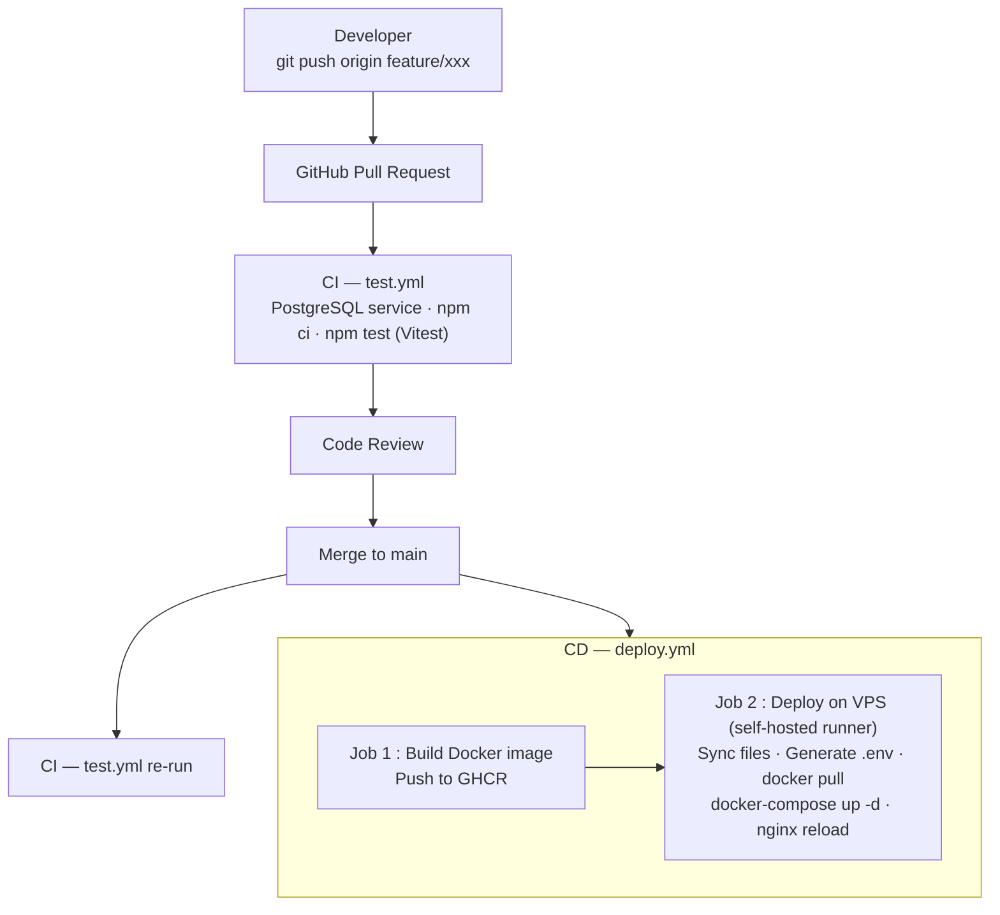

# CI/CD & Déploiement

## Pipelines GitHub Actions

Nomu dispose de deux workflows GitHub Actions :

| Workflow | Fichier | Déclencheur |
|----------|---------|-------------|
| Tests | `.github/workflows/test.yml` | Push / PR sur `main` |
| Déploiement | `.github/workflows/deploy.yml` | Push sur `main` ou déclenchement manuel |

## Workflow de développement

## Secrets GitHub requis

| Secret | Description |
|--------|-------------|
| `GHCR_TOKEN` | Personal Access Token pour GHCR |
| `DB_NAME` | Nom de la base PostgreSQL |
| `DB_USER` | Utilisateur PostgreSQL |
| `DB_PASSWORD` | Mot de passe PostgreSQL |
| `MEILI_API_KEY` | Master key Meilisearch |
| `OPENAI_API_KEY` | Clé API OpenAI |
| `SESSION_SECRET` | Secret session Express |
| `JWT_SECRET` | Secret JWT |
| `CLIENT_URL` | URL du frontend (CORS) |
