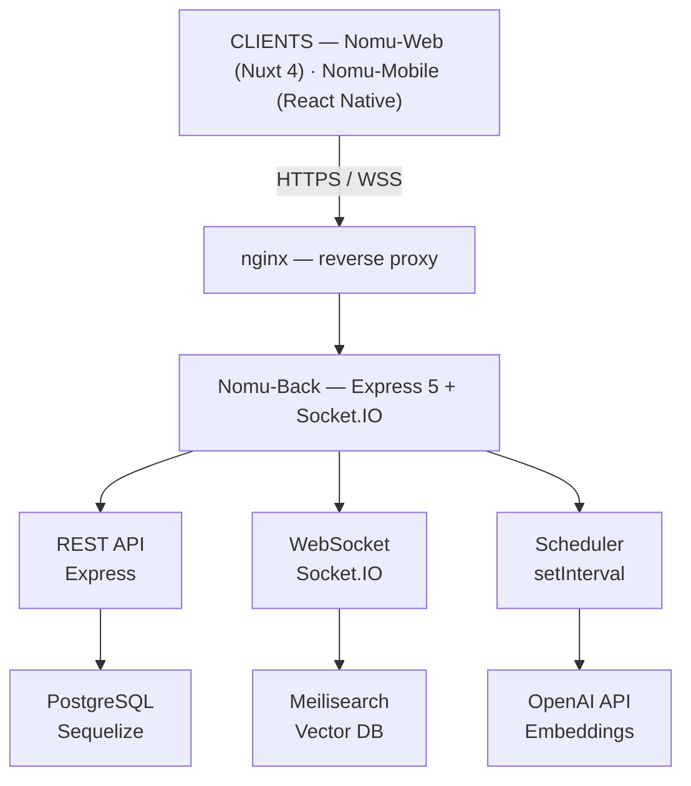
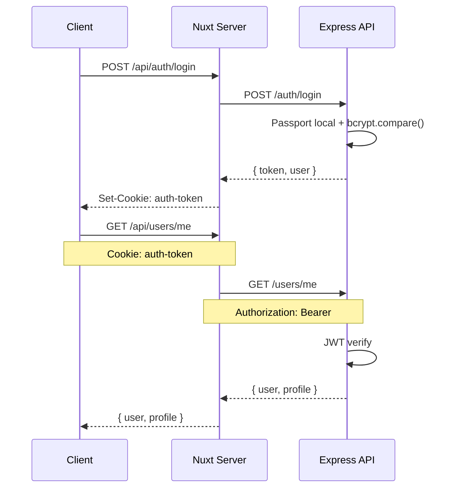
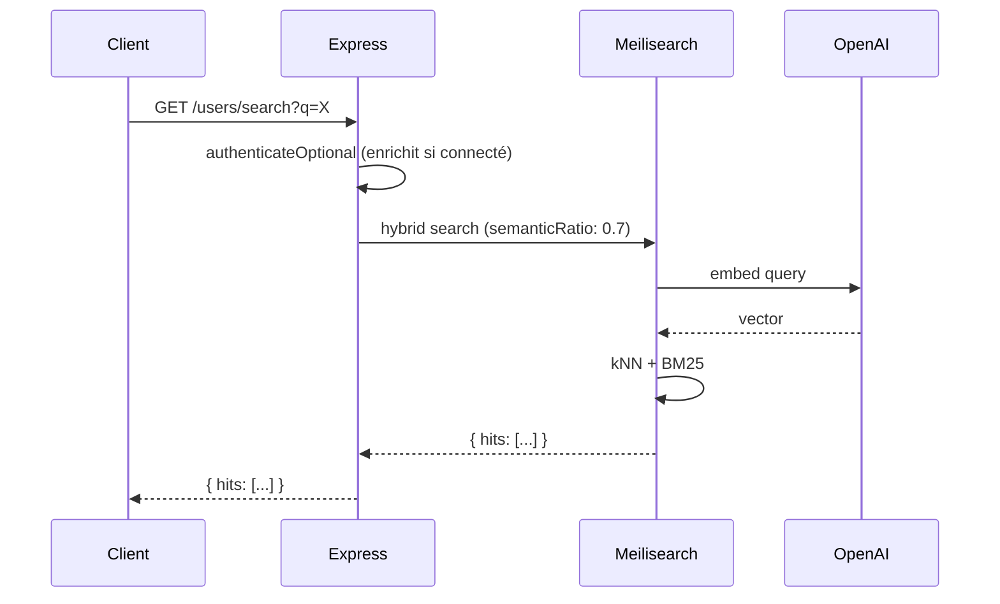

# Architecture générale

## Vue d'ensemble

## Stack technique

### Backend (Nomu-Back)

| Composant | Technologie | Version |
|-----------|-------------|---------|
| Runtime | Node.js | ≥ 18 |
| Framework | Express | 5.1.0 |
| ORM | Sequelize | 6.37.1 |
| Base de données | PostgreSQL | 14+ |
| Recherche | Meilisearch | 0.32.2 |
| Auth | Passport.js + JWT | — |
| WebSocket | Socket.IO | 4.8.1 |
| Hash | bcrypt | 6.0.0 |
| Tests | Vitest | 4.x |

### Frontend Web (Nomu-Web)

| Composant | Technologie | Version |
|-----------|-------------|---------|
| Framework | Nuxt | 4.1.3 |
| UI | Vue.js | 3.5.27 |
| State | Pinia | — |
| CSS | Tailwind CSS | 4.1.18 |
| UI Components | @nuxt/ui | 4.4.0 |
| WebSocket | socket.io-client | 4.8.3 |
| Animation | GSAP | 3.14.2 |

## Flux d'authentification

## Flux de recherche

