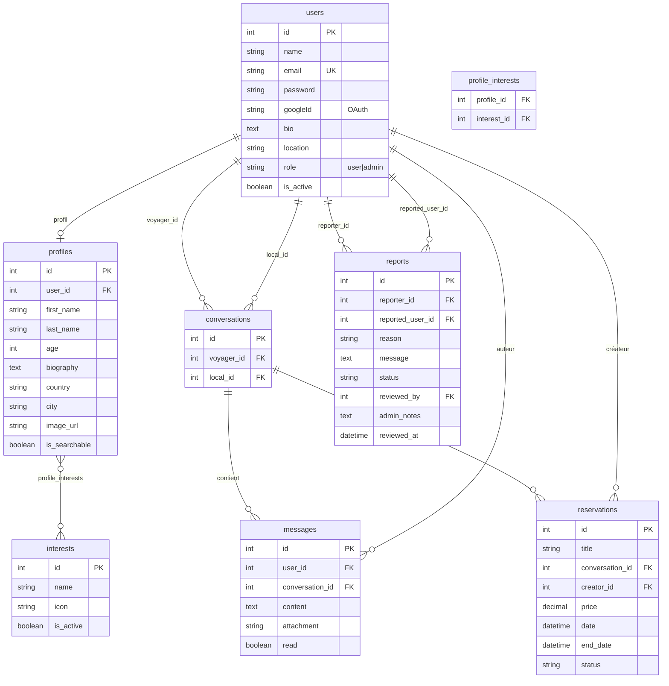

# Base de données & Modèles

## Schéma relationnel



## Modèles Sequelize

### User

```javascript
// app/models/User.js
{
  id: { type: INTEGER, autoIncrement: true, primaryKey: true },
  name: { type: STRING },
  email: { type: STRING, unique: true, allowNull: false },
  password: { type: STRING },          // bcrypt, nullable (OAuth ready)
  bio: { type: TEXT },
  location: { type: STRING },
  role: { type: STRING, defaultValue: 'user' },   // 'user' | 'admin'
  is_active: { type: BOOLEAN, defaultValue: true },
}
// toJSON() exclut le champ password automatiquement
```

### Profile

```javascript
// app/models/Profile.js
{
  id: { type: INTEGER, autoIncrement: true, primaryKey: true },
  user_id: { type: INTEGER, references: { model: 'users', key: 'id' } },
  first_name: { type: STRING },
  last_name: { type: STRING },
  age: { type: INTEGER },
  biography: { type: TEXT },
  country: { type: STRING },
  city: { type: STRING },
  image_url: { type: STRING },
  is_searchable: { type: BOOLEAN, defaultValue: false },
}
// belongsToMany Interest via 'profile_interests'
```

### Conversation

```javascript
{
  id: { type: INTEGER, autoIncrement: true, primaryKey: true },
  voyager_id: { type: INTEGER, references: 'users' },
  local_id: { type: INTEGER, references: 'users' },
  // UNIQUE(voyager_id, local_id) — une seule conversation par paire
  // Validation: voyager_id !== local_id
}
```

### Message

```javascript
{
  id: { type: INTEGER, autoIncrement: true, primaryKey: true },
  user_id: { type: INTEGER, references: 'users' },
  conversation_id: { type: INTEGER, references: 'conversations' },
  content: { type: TEXT, allowNull: false },
  attachment: { type: STRING },   // base64 data URL (image)
  read: { type: BOOLEAN, defaultValue: false },
  // Index sur (conversation_id, created_at)
  // Index sur user_id
}
```

### Reservation

```javascript
{
  id: { type: INTEGER, autoIncrement: true, primaryKey: true },
  title: { type: STRING, allowNull: false },
  conversation_id: { type: INTEGER, references: 'conversations' },
  creator_id: { type: INTEGER, references: 'users' },
  price: { type: DECIMAL(10, 2), allowNull: false },
  date: { type: DATE, allowNull: false },
  end_date: { type: DATE, allowNull: false },
  status: {
    type: ENUM('pending', 'accepted', 'declined'),
    defaultValue: 'pending',
  },
}
```

### Report

```javascript
{
  reporter_id: { type: INTEGER, references: 'users' },
  reported_user_id: { type: INTEGER, references: 'users' },
  reason: { type: STRING, allowNull: false },
  message: { type: TEXT },
  status: {
    type: ENUM('pending', 'reviewed', 'resolved', 'dismissed'),
    defaultValue: 'pending',
  },
  reviewed_by: { type: INTEGER, references: 'users' },
  admin_notes: { type: TEXT },
  reviewed_at: { type: DATE },
}
```

## Synchronisation

```javascript
// app/server.js
await sequelize.sync({
  alter: process.env.NODE_ENV !== 'production'
  // dev: alter:true adapte les tables aux modèles
  // prod: false → migrations manuelles requises
});
```

:::warning Production
En production, `alter: false` — les changements de schéma doivent passer par des migrations Sequelize pour éviter toute corruption de données.
:::
