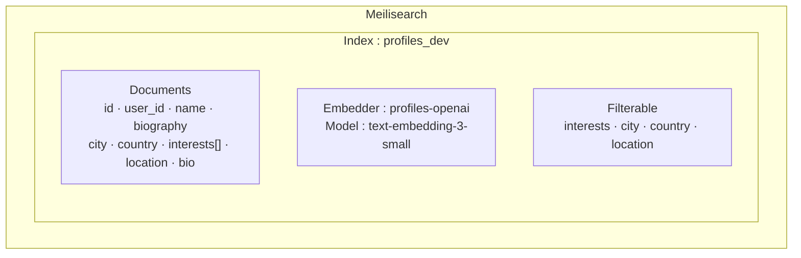

# Recherche Sémantique

## Architecture

Nomu utilise **Meilisearch** comme moteur de recherche vectorielle, couplé aux **embeddings OpenAI** pour une recherche sémantique hybride (keyword + vecteurs).



## Configuration de l'index

L'index est configuré au démarrage du serveur via `setupMeilisearchAI()` :

```javascript
// app/server.js

// 1. Activer le vector store
await fetch(`${MEILI_HOST}/experimental-features`, {
  method: 'PATCH',
  body: JSON.stringify({ vectorStore: true }),
})

// 2. Configurer l'embedder OpenAI
const embedderConfig = {
  'profiles-openai': {
    source: 'openAi',
    apiKey: OPENAI_API_KEY,
    model: 'text-embedding-3-small',
    documentTemplate:
      '{{doc.name}}, {{doc.location}}. {{doc.biography}}. Intérêts: {{doc.interests}}. {{doc.country}}, {{doc.city}}',
  },
}

// 3. Configurer les attributs filtrables
await fetch(`.../settings/filterable-attributes`, {
  body: JSON.stringify(['interests', 'location', 'country', 'city']),
})
```

## Document template

Le template définit ce qui est vectorisé pour chaque profil :

```
{{doc.name}}, {{doc.location}}. {{doc.biography}}. Intérêts: {{doc.interests}}. {{doc.country}}, {{doc.city}}
```

Exemple rendu :

> Marie Dupont, Paris. Je propose des randonnées guidées autour de Paris. Intérêts: Randonnée, Cuisine. France, Paris

## Réindexation

L'index est maintenu à jour par trois mécanismes :

| Déclencheur | Quand |
|-------------|-------|
| Démarrage serveur | Au boot, réindexation complète |
| Scheduler | Toutes les 2 heures automatiquement |
| Actions utilisateur | Mise à jour profil, toggle searchable, update interests |
| Script manuel | `npm run reindex` |
