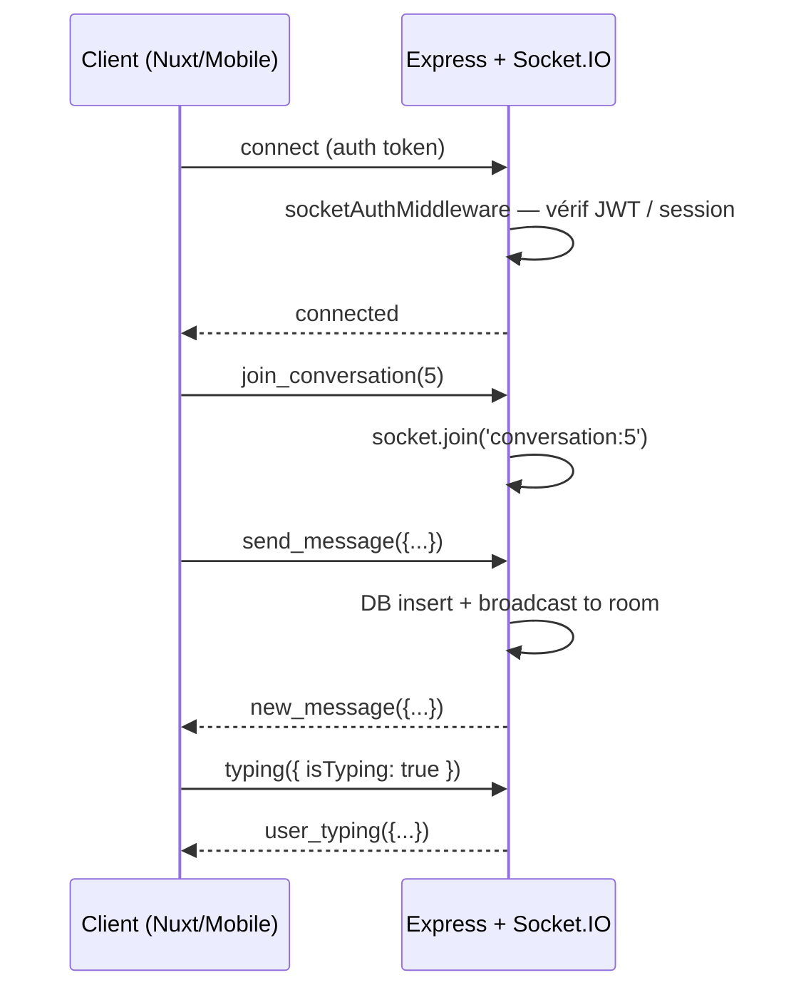

# WebSocket — Messagerie temps réel

## Architecture

Nomu utilise **Socket.IO 4.x** pour la messagerie instantanée entre membres.



## Connexion et authentification

```typescript
// app/services/websocket/socketAuth.js
export const socketAuthMiddleware = async (socket, next) => {
  // 1. Session Passport
  const passportUser = socket.request.session?.passport?.user
  if (passportUser) {
    const user = await User.findByPk(passportUser)
    socket.dbUser = user
    socket.userId = user.id
    socket.userEmail = user.email
    return next()
  }

  // 2. JWT dans handshake.auth.token
  const token = socket.handshake.auth?.token
  if (token) {
    const payload = jwt.verify(token, JWT_SECRET)
    const user = await User.findByPk(payload.id || payload.userId)
    socket.dbUser = user
    socket.userId = user.id
    return next()
  }

  return next(new Error('Non authentifié'))
}
```

### Connexion côté client (Nuxt)

```typescript
// app/composables/useSocket.ts
function connect(): Socket {
  const token = getToken()
  socket = io(socketUrl, {
    auth: { token },
    transports: ['websocket', 'polling'],
    reconnection: true,
    reconnectionAttempts: 5,
    reconnectionDelay: 1000,
    reconnectionDelayMax: 5000,
  })
  return socket
}
```

## Rooms

Chaque conversation a sa propre room Socket.IO :

Room ID : `conversation:{conversation_id}` — exemple : `conversation:5`

Les messages sont broadcast à tous les membres de la room, session incluse pour la lecture cross-device.
